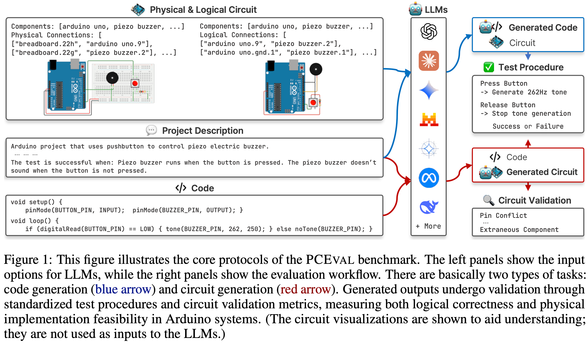

# PCEval: A Benchmark for Evaluating Physical Computing Capabilities of Large Language Models
> **Note:** This dataset is released as part of the supplementary materials for **ICLR 2026 submission #13535**.

<!--Figure: docs/front.png-->


PCEval is a benchmark dataset designed to systematically evaluate the capabilities of Large Language Models (LLMs) in physical computing projects, specifically focusing on Arduino-based tasks. It assesses an LLM's proficiency in generating both logical and physical circuit designs, as well as producing compatible Arduino code for these circuits, across varying levels of project complexity.

The primary goal of PCEval is to provide empirical insights into an LLM's ability to reason about hardware components, their connections, and the physical constraints inherent in circuit implementation. This benchmark aims to advance our understanding of AI assistance in hardware-dependent computing environments and establish a foundation for developing more effective tools to support physical computing education and practice.

## Dataset Structure

The PCEval benchmark comprises 50 unique Arduino projects, categorized into four distinct complexity levels:

*   **Level 1: Single Component Behavior Verification.** Focuses on the basic operation and control of individual hardware components (e.g., blinking an LED, reading a temperature sensor).
*   **Level 2: Handling Changing Input Values.** Requires LLMs to manage and respond to dynamic inputs or generate varying outputs (e.g., controlling RGB LED color based on input, implementing a button-press duration counter).
*   **Level 3: Component State Changes based on Inputs.** Involves more complex interactions where the state of one component influences another, often requiring conditional logic (e.g., sensor-driven LED/motor activation).
*   **Level 4: Creative Project Creation.** Tasks demand the integration of multiple components and concepts to build a more complete and functional system (e.g., multi-timezone clock, D-Day counter).

Each project instance within the dataset follows a standardized directory structure:

```
{project_level}/
└── {project_name}/
    ├── scenario.yaml               # Test Procedure: Defines test steps and expected outcomes
    ├── diagram.json                # Logical Circuit: Specifies components and logical pin-to-pin connections
    ├── diagram_breadboard.json     # Physical Circuit: Details breadboard layout and physical wiring
    ├── description.md              # Project Description: Natural language outline of requirements and behavior
    ├── platformio.ini              # PlatformIO Configuration: Build environment settings for Arduino
    ├── src/
    │   └── main.ino                # Arduino Code: The .ino sketch for the project
    └── wokwi.toml                  # Wokwi Simulator Configuration: Settings for the Wokwi simulator
```

### Key File Descriptions:

*   **`description.md` (D)**: A natural language description of the project's purpose, components, expected behavior, and success criteria. This often serves as the primary input/prompt for the LLM.
*   **`diagram.json` (L)**: A logical representation of the circuit, detailing components and their direct pin-to-pin connections, independent of physical layout.
*   **`diagram_breadboard.json` (P)**: A physical representation of the circuit, specifying the exact breadboard hole connections for components and wires.
*   **`src/main.ino` (C)**: The Arduino sketch that implements the required functionality for the project.
*   **`scenario.yaml` (T)**: Defines the validation steps and expected outputs (e.g., pin states, serial messages) to automatically test the functionality of the generated code and circuit in a simulated environment.
*   **`platformio.ini`**: Configures the PlatformIO build environment for compiling the Arduino code.
*   **`wokwi.toml`**: Configures the Wokwi simulator, often pointing to the compiled firmware for simulation.

All project instances, including their logical circuits (L), physical circuits (P), and Arduino code (C), have been verified for correctness and functionality on actual Arduino hardware, following the test procedures (T). The projects utilize a range of 15 distinct and commonly used components (e.g., LEDs, push buttons, humidity sensors, OLED displays).

## Using the Dataset

Each project can be independently compiled and simulated. The typical workflow is:

1.  **Navigate to the project directory**:
    ```bash
    cd projects/{project_level}/{project_name}
    ```
2.  **Compile the Arduino code**:
    ```bash
    pio run
    ```
    A successful compilation will typically show:
    ```
    ==================================== [SUCCESS] Took X.XX seconds ====================================
    ```
3.  **Run the simulation using Wokwi CLI**:
    ```bash
    wokwi-cli --scenario scenario.yaml --diagram-file diagram.json # For logical circuit based tasks
    # or
    wokwi-cli --scenario scenario.yaml --diagram-file diagram_breadboard.json # For physical circuit based tasks
    ```
    A successful simulation will output:
    ```
    [{project_name}] Scenario completed successfully
    ```
    Failures might result in timeout messages or specific error details from the scenario execution.

## Evaluation Tasks

PCEval is designed to evaluate LLMs on various physical computing tasks, including (but not limited to):

1.  **Logical Circuit Generation (D, C → L)**: Given a project description and Arduino code, generate the logical circuit.
2.  **Physical Circuit Generation (D, C → P)**: Given a project description and Arduino code, generate the physical breadboard circuit.
3.  **Code Generation from Logical Circuit (D, L → C)**: Given a project description and a logical circuit, generate the Arduino code.
4.  **Code Generation from Physical Circuit (D, P → C)**: Given a project description and a physical circuit, generate the Arduino code.